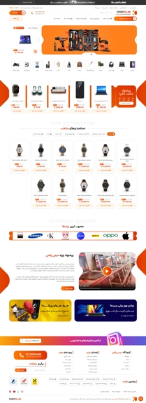

# وب‌سایت نمونه کار: digi plus

وبسایت digi-plus یک وبسایت فروشگاهی زیبا و مدرن با قابلیت های متنوع میباشد که با استفاده از React طراحی شده است .
از dummy.json برای دریافت داده های فیک استفاده شده است.

## 🔗 لینک دمو

<a href="https://digi-plus.netlify.app/" target="_blank">مشاهده وب‌سایت به صورت زنده</a>

---

## جزئیات سایت

- امکان جستجو , فیلتر , مرتب سازی و صفحه بندی محصولات که همگی سمت کلاینت انجام میشود.
- سبد خرید و امکان افزودن محصول به لیست مورد علاقه ها
- مگا منو
- چت پشتیبانی آنلاین
- مشاهده سریع محصول
- مقایسه محصولات با یکدیگر
- صفحه ثبت سفارش و پرداخت
- صفحه داشبورد کاربر
- احراز هویت کاربر با jwt
- دپلوی شده روی Netlify

---

## 🛠️ تکنولوژی‌های استفاده شده

- React (vite , cra)
- react-router-dom
- tailwind css
- SwiperJS
- persian-date
- Netlify
- DummyJson : برای دریافت اطلاعات محصولات و ...

## 🚀 نحوه راه‌اندازی پروژه
